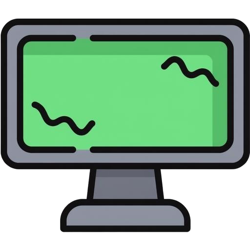
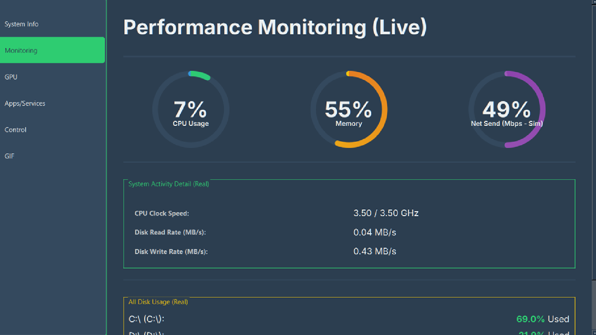

PC HMI (Human-Machine Interface) System Dashboard
=================================================


[](https://github.com/aamitn/pc-hmi/actions/workflows/buildexec.yml)

A cross-platform (primarily focused on Windows and Linux/macOS) GUI application built with Python and PyQt6 designed to monitor and display critical system performance metrics, including CPU, GPU, and RAM utilization, in a dedicated, custom window.

designed with a usecase purpose as a dedicated, interactive screen for system status monitoring, often intended for secondary displays or dedicated panel PCs.

Features Set
-----------



-   **Real-time Monitoring:** Track CPU, Memory, Disk, and Network usage using `psutil`.

-   **GPU Detection:** Advanced support for multiple GPU vendors:

    -   NVIDIA support via `pynvml` and `GPUtil`.

    -   AMD support via `pyamdgpuinfo` and `pyadl`.

    -   General GPU detection via `GPUtil`.

-   **Cross-Platform GUI:** Built with **PyQt6** for a native and responsive user interface (`--windowed` mode).

-   **Dedicated Display:** Finds and uses a specified target monitor resolution for deployment (configured via `settings.ini`).

-   **Single-File Executable:** Can be packaged into a single, portable executable using PyInstaller.

Developer Setup & Project Structure
---------------------------------------

This section is for contributors and developers who want to run the source code directly or modify the application.

### Prerequisites

You must have **Python 3.8+** installed on your system.

### 1\. Cloning the Repository

```
git clone [https://github.com/aamitn/pc-hmi.git](https://github.com/aamitn/pc-hmi.git)
cd pc-hmi

```

### 2\. Dependency Installation

The application relies on several system monitoring and GUI libraries. We highly recommend using a Python Virtual Environment (`venv`) for development.

```
# Create and activate virtual environment
python3 -m venv venv
source venv/bin/activate  # On Windows, use: .\venv\Scripts\activate

# Install core and vendor-specific dependencies
pip install screeninfo PyQt6 psutil py-cpuinfo

# Install GPU-specific dependencies (optional, but required for full functionality)
# Install all known dependencies to ensure compatibility:
pip install pynvml GPUtil pyamdgpuinfo pyadl wmi
# Note: 'wmi' is Windows-specific. Other packages will install if available for your OS.

```

### 3\. Running the Application from Source

Once dependencies are installed, you can run the application directly:

```
$PYTHON_CMD hmi.py

```

*(If you are in a virtual environment, `$PYTHON_CMD` will typically be `python` or `python3`.)*

**Note:** If a `settings.ini` file is not present, the application may create a default one or exit, depending on the internal logic of `hmi.py`.

Building the Executable for Distribution
-------------------------------------------

The repository includes shell scripts to package the application into a standalone executable for easy distribution.

### 1\. Requirements for Building

Ensure you have **PyInstaller** installed:

```
pip install pyinstaller

```

### 2\. Configuration (`settings.ini`)

Before building, ensure your `settings.ini` file is configured correctly. This file will be bundled directly into the executable.

| Setting           | Description                                                                 |
|------------------|-----------------------------------------------------------------------------|
| config_resolution | The target resolution/monitor the HMI should attempt to launch on (e.g., 1920x1080). |
| giphy_api_key     | Used for Giphy integration (if implemented in `hmi.py`).                   |


### 3\. Running the Build Script

#### Linux/macOS (using `build_dashboard.sh`)

1.  Make the script executable:

    ```
    chmod +x build_dashboard.sh

    ```

2.  Run the build process:

    ```
    ./build_dashboard.sh

    ```

The script will install PyInstaller if missing, clean up old build files, and then execute:

```
pyinstaller --onefile --windowed --name="pc-hmi"\
            --add-data="settings.ini:."\
            --collect-all=PyQt6\
            # ... and various hidden-imports for hardware detection ...
            hmi.py

```

#### Windows (Equivalent Batch File)

The equivalent Windows batch file (`build.bat` - not provided, but inferred) would execute the same logic.

### 4\. Output

After a successful build, the standalone executable will be located in the newly created `dist/` directory:

-   **Linux/macOS:**  `dist/pc-hmi`

-   **Windows:**  `dist\pc-hmi.exe`

Contributiions
------------------

We welcome contributions! Please feel free to open an issue or submit a Pull Request.

1.  Fork the repository.

2.  Create a new feature branch (`git checkout -b feature/AmazingFeature`).

3.  Commit your changes (`git commit -m 'Add some AmazingFeature'`).

4.  Push to the branch (`git push origin feature/AmazingFeature`).

5.  Open a Pull Request.